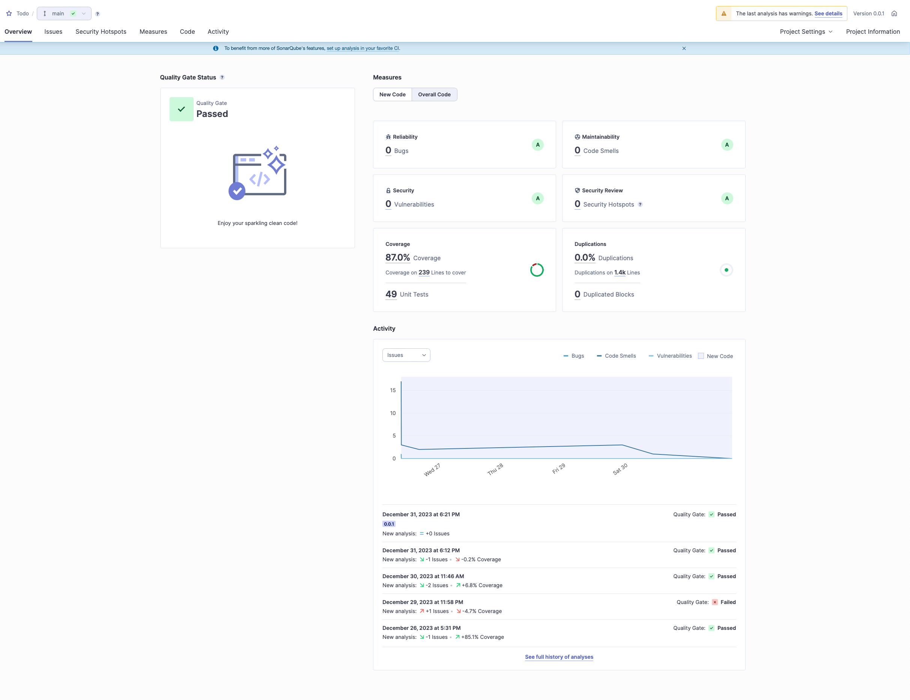

# Project Name

## Introduction

This project is a [React Native](https://reactnative.dev) application developed as part of an interview exercise. It was bootstrapped using [`@react-native-community/cli`](https://github.com/react-native-community/cli).

## The approach

In order to follow the best practices, I started by setting up different code quality tools for the codebase.

I have added typescript for strict typing, **_prettier_** for code formatting, **_jest_** and **_react-testing-library_** for unit testing and **_sonarqube_** for code coverage, code smells and vulnerabilities.

In addition, I have set up a **_pre-commit_** hook using **_husky_** that will automaticaly format all the changed files as well as running all the **_typescript, eslint and test checks_** to ensure that nothing is merged that can potentially break the app.

## Installation

To install and run this project, you will need to follow these steps:

1. Ensure that you have completed the [React Native - Environment Setup](https://reactnative.dev/docs/environment-setup) instructions till "Creating a new application" step. It is important to say that for android, minimum JAVA 17 is required.
1. Clone this repository to your local machine.
1. Navigate to the project directory and install dependencies with `yarn install`.
1. Start the Metro server with `yarn start`.
1. - In a new terminal, start the application with `yarn android`.
   - In a new terminal, run `xcrun simctl list devices` to find a list with the available ios devices. `yarn pod:install && yarn ios --simulator="{iphone model}"` e.g.`yarn ios --simulator="iPhone 14"`.

## Demo

Watch a demo of the application: https://drive.google.com/file/d/16XmEgUBo4H_CkA5_OVE9U2U6twPS1AnB/view?usp=drive_link

## Usage Instructions

After you have started the application, you can start interracting with the application.

### TodoLists

After the initial load, the user can see the **_TodoLists screen_**. If there are any lists already created, you will see a list of them.

Above the list, there is a button that triggers a modal so a user can **_add a new list_**. By **_swiping_** a TodoList, the user can either **_edit or delete a list_**.

By clicking a TodoList, the user will be navigated to the **_TodoList screen_**.

### TodoList

In the TodoList screen the user can **_see all the items associated with a specific list_**.

At the top there are two actions.

At the left there is an IconButton where if clicked, a menu is shown so a user can either **_sort the items alphabetically or by creationDate_**, or **_hide/show the completed items_**.

At the right hand side, there is a button so a user can **_add new item to the list_**. If the value is **_empty, the input is highlighted, and the 'Done' button is disabled_**.

Below this section, the user can find all the items of the list. The items have 3 statuses. ACTIVE, INACTIVE and EDIT. By **_clicking_** an item, status is **_changed from ACTIVE to INACTIVE and vice versa_**. By **_swiping_** an item, the user can either **_edit or delete_** it.

In edit mode, the card is being replaced by an **_input_** which acts the same way as the input in the dialog. To ensure this, the Input component was build as a **_reusable component_**. The only difference is that, because the edit item is not in a dialog, there is no submit button, hence I have added an **_IconButton that can be enabled using a prop_**, which when clicked the change is **_submitted_**.

### Extra

As soon as the user puts the application in the background, **_I trigger a push notification_** that will be shown after 10 seconds.

In addition to **_redux_** for state management, I also used **_redux-persist_**, which manage the transfer and synchronisation of redux state and **_async-storage_**, in order to **_persist the data even if the application is closed_**.

## Code Quality

As mentioned above, I have used several tools to ensure the best code quality possible.

1. **_Typescript_** is a statically typed superset of JavaScript that compiles to plain JavaScript. Having strict types helps catch errors during development, improves code readability, and provides better tooling support.
1. **_Eslint_** is a popular JavaScript linter that helps identify and fix common coding errors and enforce coding standards.
1. **_Husky_** is a Git hook tool that allows you to run scripts before committing or pushing code. In this project, Husky is used to set up a pre-commit hook that formats the changed files and runs TypeScript, ESLint, and test checks, acting as a proactive shield, ensuring that only working and formatted code is merged.
1. **_jest_** is a JavaScript testing framework that provides a simple and powerful way to write unit tests for your code.
1. **_react-testing-library_** is a Javascript library used for testing React/React-Native components. Using it with jest, it gives you the ability to test user interractions by firing events like pressing a button or editing a textfield, which enables meaningful test and side-effects of specific actions
1. **_Sonarqube_** is a static code analysis tool that provides insights into code quality, code smells, vulnerabilities, and code coverage. I am attaching a screenshot of the latest run on my sonarqube check, displaying the results of the analysis, including final numbers of code coverage and code duplication.

